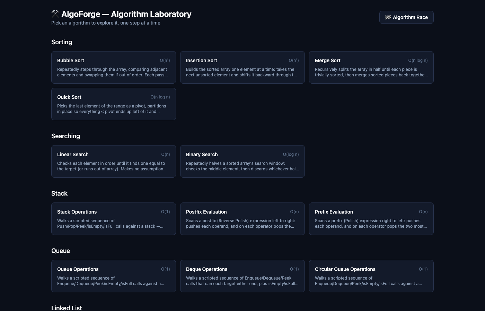
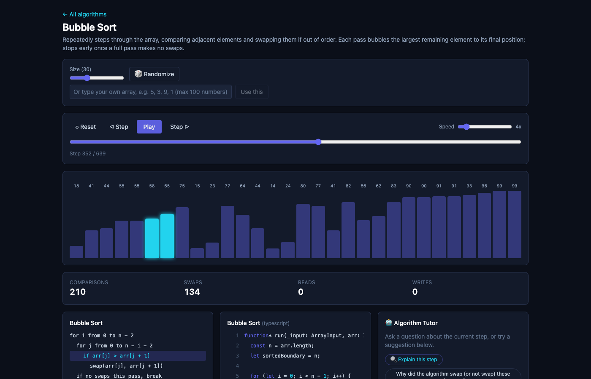
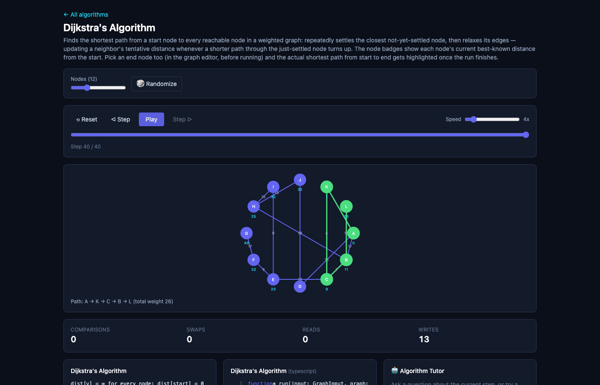
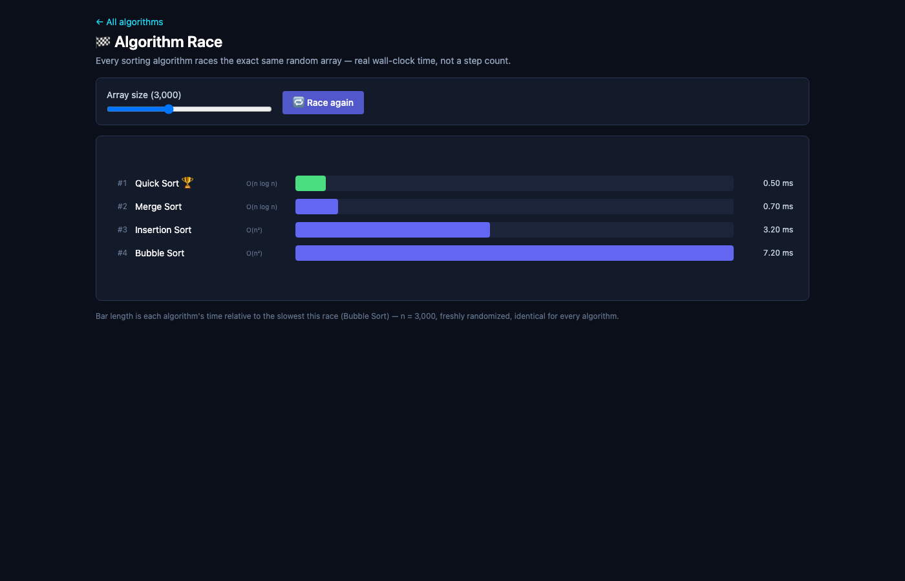
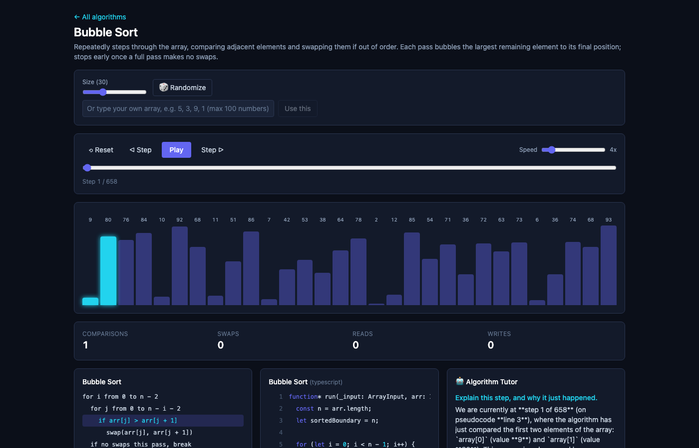

<p align="center">
  
  
  
  
  
  
  
</p>

<h1 align="center">⚒️ AlgoForge</h1>
<p align="center"><b>Interactive Algorithm Laboratory</b></p>
<p align="center">Step through sorting, searching, graph, tree, and data-structure algorithms one operation at a time — with synced pseudocode, real source, live stats, timeline scrubbing, and an AI tutor that explains exactly what's on screen.</p>

<p align="center">
  <a href="https://algo-forge.vercel.app/"><b>🚀 Live Demo</b></a> ·
  <a href="https://algo-forge-h8f8.onrender.com/">AI Tutor backend</a>
</p>

---

## 📸 Screenshots

|  |  |
|---|---|
|  |  |
| Home — every algorithm, grouped by category | Step-by-step playback, with synced pseudocode + source panels |
|  |  |
| Dijkstra — real shortest path highlighted end-to-end | Algorithm Race — four sorts, one array, real wall-clock time |
|  | |
| AI Tutor — grounded in the exact current step, not a generic answer | |

---

## ✨ What it does

Instead of just animating an algorithm, AlgoForge exposes *why* each step happened:

- ▶️ Play / pause / step forward & backward / scrub to any point in the run
- 📊 Live comparisons, swaps, reads, and writes as the algorithm runs
- 🧭 Pseudocode and real source code highlighted in sync with the current step
- 🌐 A click-to-build graph editor — add nodes, connect them, set weights, pick a start *and* end node
- 🏁 **Algorithm Race** — race Bubble/Insertion/Merge/Quick Sort against each other on the same array, timed in real milliseconds
- 🤖 An AI tutor that answers questions grounded in the exact current step, not a generic explanation

## 🧩 Algorithms & data structures

| Category | Included |
|---|---|
| **Sorting** | Bubble, Insertion, Merge, Quick |
| **Searching** | Linear, Binary |
| **Stacks** | Stack Operations, Postfix Evaluation, Prefix Evaluation |
| **Queues** | Queue, Deque, Circular Queue Operations |
| **Linked Lists** | Singly / Doubly / Circular Operations, Merge, Comparison |
| **Trees** | BST Insert, Inorder / Preorder / Postorder Traversal |
| **Graphs** | BFS, DFS, Dijkstra's, Prim's, Kruskal's — the last three highlight the resulting path between a chosen start and end node |

## 🤖 AI Algorithm Tutor

Every question is answered with the current algorithm, pseudocode line, active step, and live stats as context — so the answer is about *this exact moment* in *this exact run*, not a generic textbook explanation.

```text
"Why did it swap these two elements?"
"Explain this step like I'm a beginner."
"Why did Dijkstra pick this node next?"
"What happens if I change this input?"
```

---

## Installation

```bash
git clone https://github.com/PriyamKeshri/algo-forge.git
cd algo-forge
pnpm install
pnpm dev          # web app → http://localhost:5173
pnpm dev:all      # web app + AI Tutor backend together
```

The AI Tutor needs a Gemini API key — see [`apps/server/README.md`](apps/server/README.md) for local setup.

---

## 📄 License

Licensed under the Apache License 2.0 — see [LICENSE](LICENSE).

<p align="center">
  Built with ⚒️, TypeScript, and a lot of algorithmic curiosity.
</p>
